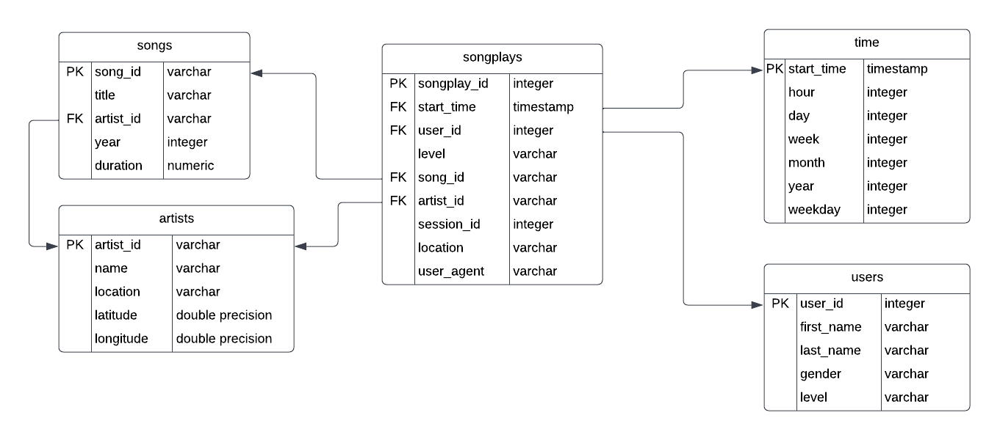

# Goal

Build an ETL pipeline (technically it is 'ELT') that extracts JSON data from S3, stages it in Redshift, and transforms data into a set of dimensional tables for the analytics team.

# Files
**create_table.py**  Creates fact and dimension tables for the star schema in Redshift.

**etl.py** Loads data from S3 into staging tables on Redshift.  Then process that data into analytics tables on Redshift.

**sql_queries.py** Central script containing all SQL statements

**run.ipynb** Interactive notebook that utilizes boto3 to programmatically create the Redshift cluster and start the ETL process by running create_table.py and etl.py

**dwh.cfg** This file contains project-wide parameters. HOST and ARN parameters should be copied from the AWS console and pasted here per instructions in run.ipynb

# How to Run

Using the AWS Console create 1 user and 1 role.

Create user `dwhadmin` with programmatic access and privileges:
- AdministratorAccess
- AmazonRedshiftFullAccess
- AmazonS3ReadOnlyAccess
- AmazonSSMFullAcces

Copy the KEY and SECRET into run.ipynb

Create a `dwhRole` with privileges:
- AmazonS3ReadOnlyAccess

Copy the dwhRole ARN into `dwh.cfg`

Run the Redshift cluster once and copy the cluster hostname into the variable HOST inside `dwh.cfg`

Run by executing run.ipynb
